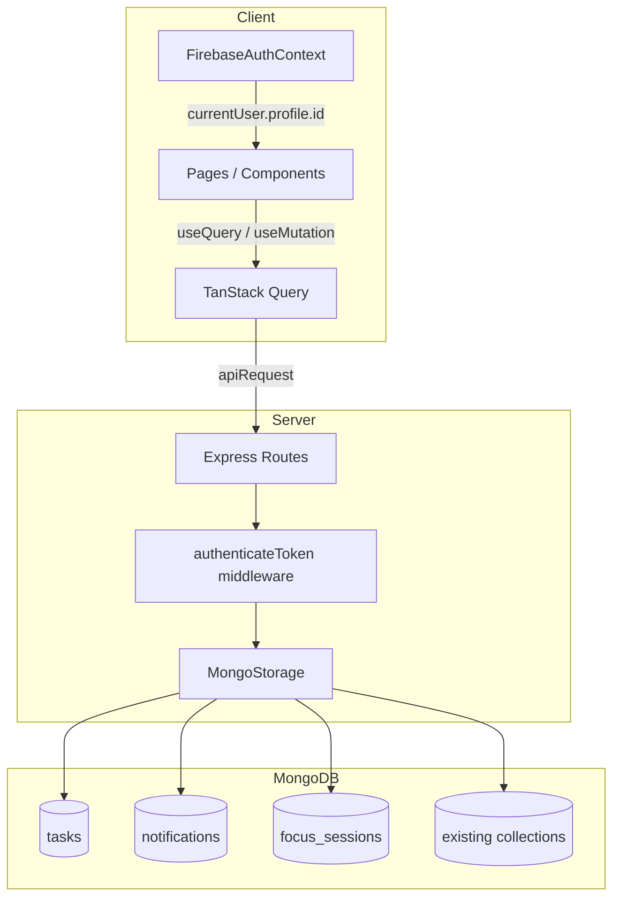

# Design Document: Complete Incomplete Features

## Overview

This document describes the technical design for completing nine partially-implemented features in PersonalLearningPro. The work falls into three categories:

1. **New backend collections + APIs** — Tasks, Notifications, Focus Sessions (Requirements 1, 2, 7)
2. **Frontend wiring to existing APIs** — Tests List, Student Directory, Dashboards, Analytics (Requirements 3, 4, 5, 8)
3. **Bug fixes and refactors** — MessagePal auth, Landing page extraction (Requirements 6, 9)

All new backend work follows the established pattern: Mongoose schema in `shared/mongo-schema.ts`, Zod schema in `shared/schema.ts`, storage methods in `server/storage.ts`, and routes in `server/routes.ts`.

---

## Architecture



The three new MongoDB collections (tasks, notifications, focus_sessions) are additive — no existing schemas are modified. Frontend pages switch from local `useState` with mock arrays to `useQuery`/`useMutation` hooks backed by the new endpoints.

---

## Components and Interfaces

### Requirement 1 — Tasks API

**Storage interface additions (`IStorage`):**
```typescript
createTask(task: InsertTask): Promise<Task>;
getTasksByUser(userId: number): Promise<Task[]>;
updateTask(id: number, update: Partial<InsertTask>): Promise<Task | undefined>;
deleteTask(id: number, userId: number): Promise<boolean>;
```

**API routes (`/api/tasks`):**
| Method | Path | Auth | Description |
|--------|------|------|-------------|
| POST | `/api/tasks` | required | Create task, returns 201 |
| GET | `/api/tasks` | required | List tasks for current user |
| PATCH | `/api/tasks/:id` | required | Update task; 403 if not owner |
| DELETE | `/api/tasks/:id` | required | Delete task; 403 if not owner |

**Frontend (`tasks.tsx`):**
- Replace `useState<Task[]>(MOCK_TASKS)` with `useQuery({ queryKey: ["/api/tasks"] })`
- Add `useMutation` for create (POST), status update (PATCH on drag), delete
- Optimistic update on drag: update local cache immediately, roll back on error

### Requirement 2 — Notifications API

**Storage interface additions:**
```typescript
createNotification(n: InsertNotification): Promise<Notification>;
getNotificationsByUser(userId: number): Promise<Notification[]>;
markNotificationRead(id: number, userId: number): Promise<Notification | undefined>;
dismissNotification(id: number, userId: number): Promise<boolean>;
markAllNotificationsRead(userId: number): Promise<boolean>;
```

**API routes (`/api/notifications`):**
| Method | Path | Auth | Description |
|--------|------|------|-------------|
| GET | `/api/notifications` | required | List notifications, desc by createdAt |
| PATCH | `/api/notifications/:id/read` | required | Mark one read |
| PATCH | `/api/notifications/read-all` | required | Mark all read |
| DELETE | `/api/notifications/:id` | required | Delete notification |

**Frontend (`notifications.tsx`):**
- Replace `useState<Notification[]>(MOCK_NOTIFICATIONS)` with `useQuery({ queryKey: ["/api/notifications"] })`
- `useMutation` for mark-read, dismiss, mark-all-read with `invalidateQueries` on success

### Requirement 3 — Tests List Real API

**Frontend (`tests-list.tsx`):**
- Remove `MOCK_TESTS` constant
- Add `useQuery<Test[]>({ queryKey: ["/api/tests"] })`
- Map server `Test` fields to the existing `StudentTest` UI shape via a `mapServerTest(t: Test): StudentTest` helper
- Add loading skeleton (reuse `Skeleton` from shadcn/ui) and error state with retry button
- Compute summary stats from the live array instead of the mock

### Requirement 4 — Student Directory Real API

**Frontend (`student-directory.tsx`):**
- Change query key from `["/api/students"]` to `["/api/users", { role: "student" }]`
- Remove `enabled: false`
- Remove `mockStudents` fallback; show skeleton grid while loading, error message on failure
- The existing search/filter logic operates on `displayStudents` — just replace the source

### Requirement 5 — Dashboard Real Data

Each dashboard gets targeted `useQuery` calls:

| Dashboard | Queries added |
|-----------|--------------|
| `admin-dashboard.tsx` | `GET /api/users?role=principal`, `GET /api/users?role=teacher`, `GET /api/users?role=student`, `GET /api/users?role=parent`, `GET /api/users` (table) |
| `principal-dashboard.tsx` | `GET /api/tests`, `GET /api/users?role=student` |
| `parent-dashboard.tsx` | `GET /api/users/children` |
| `school-admin-dashboard.tsx` | `GET /api/school/teachers` (already works), activity feed and performance chart queries |

All dashboards: wrap each stat card in a `Skeleton` while loading; show inline error badge on failure without crashing the page.

### Requirement 6 — MessagePal Auth Fix

**`use-messagepal-ws.ts`:**
```typescript
// Add optional parameter
export function useMessagePalWebSocket(currentUserId?: number) { ... }
```
The hook uses `currentUserId` internally wherever `1` or `2` are hardcoded. When `currentUserId` is undefined, the hook defers `connect()` until it is provided.

**`messagepal-panel.tsx`:**
```typescript
const { currentUser } = useFirebaseAuth();
const userId = currentUser?.profile?.id;  // numeric ID from /api/users/me if needed

// Defer rendering until userId is resolved
if (!userId) return <LoadingState />;

const ws = useMessagePalWebSocket(userId);
```

- `MessageSidebar`: replace `p.id !== 1` with `p.id !== userId`
- `MessageChatWindow`: replace `msg.senderId === 1` with `msg.senderId === userId`; replace `msg.recipientId === 1` with `msg.recipientId === userId`; resolve recipient from `activeConversation.participants.find(p => p.id !== userId)`

### Requirement 7 — Focus Sessions Persistence

**Storage interface additions:**
```typescript
createFocusSession(session: InsertFocusSession): Promise<FocusSession>;
getFocusSessionsByUser(userId: number): Promise<FocusSession[]>;
```

**API routes (`/api/focus-sessions`):**
| Method | Path | Auth | Description |
|--------|------|------|-------------|
| POST | `/api/focus-sessions` | required | Persist completed session, returns 201 |
| GET | `/api/focus-sessions` | required | List sessions for user, desc by completedAt |

**Frontend (`focus.tsx`):**
- On timer reaching zero: call `createSessionMutation.mutate({ subject, mode, durationSeconds: currentMode.duration })`
- On mount: `useQuery({ queryKey: ["/api/focus-sessions"] })` to populate `logs` and today's stats
- On mutation failure: keep the session in local `logs` state (already the case with `setLogs`)

### Requirement 8 — Individual Student Analytics

**New API route:**
```
GET /api/analytics/students
```
Returns aggregated per-student data by joining `TestAttempt` and `Analytics` collections:
```typescript
interface StudentAnalyticsSummary {
  studentId: number;
  name: string;
  avatar?: string;
  averageScore: number;          // mean score across all attempts
  completionRate: number;        // completed attempts / assigned tests
  subjectBreakdown: { subject: string; averageScore: number }[];
  recentAttempts: { testId: number; score: number; completedAt: Date }[];
}
```

**Frontend (`analytics.tsx`):**
- Replace "Coming Soon" content in `TabsContent value="individuals"` with a `useQuery` call
- Render `StudentAnalyticsCard` components (new sub-component) with skeleton fallback
- Expandable card on click showing `recentAttempts` table

### Requirement 9 — Landing Page Component Extraction

Extract these components from `landing.tsx` into `client/src/components/landing/`:

| File | Component | Key props |
|------|-----------|-----------|
| `hero.tsx` | `Hero` | `heroImage?: string`, `onCta?: () => void` |
| `features.tsx` | `Features` | `features?: FeatureCard[]` |
| `testimonials.tsx` | `Testimonials` | `testimonials?: Testimonial[]` |
| `cta.tsx` | `CallToAction` | `headline?: string`, `ctaLabel?: string`, `onCta?: () => void` |
| `index.ts` | barrel export | — |

`landing.tsx` becomes a thin composition file that imports from `@/components/landing`.

---

## Data Models

### Task (new)

**Zod (`shared/schema.ts`):**
```typescript
export const insertTaskSchema = z.object({
  userId: z.number(),
  title: z.string().min(1),
  status: z.enum(["backlog", "todo", "in-progress", "review", "done"]).default("todo"),
  priority: z.enum(["low", "medium", "high", "urgent"]).default("medium"),
  tags: z.array(z.string()).default([]),
  dueDate: z.string().optional().nullable(),
  comments: z.number().default(0),
  attachments: z.number().default(0),
});
export type Task = z.infer<typeof insertTaskSchema> & { id: number; createdAt: Date };
export type InsertTask = z.infer<typeof insertTaskSchema>;
```

**Mongoose (`shared/mongo-schema.ts`):**
```typescript
const TaskSchema = new mongoose.Schema({
  id: { type: Number, required: true, unique: true },
  userId: { type: Number, required: true, index: true },
  title: { type: String, required: true },
  status: { type: String, enum: ["backlog","todo","in-progress","review","done"], default: "todo" },
  priority: { type: String, enum: ["low","medium","high","urgent"], default: "medium" },
  tags: [{ type: String }],
  dueDate: { type: String, default: null },
  comments: { type: Number, default: 0 },
  attachments: { type: Number, default: 0 },
  createdAt: { type: Date, default: Date.now },
});
export const MongoTask = mongoose.model("Task", TaskSchema);
```

### Notification (new)

**Zod:**
```typescript
export const insertNotificationSchema = z.object({
  userId: z.number(),
  type: z.enum(["test", "result", "announcement", "message", "achievement", "reminder"]),
  title: z.string().min(1),
  body: z.string().min(1),
  isRead: z.boolean().default(false),
  meta: z.string().optional().nullable(),
});
export type Notification = z.infer<typeof insertNotificationSchema> & { id: number; createdAt: Date };
export type InsertNotification = z.infer<typeof insertNotificationSchema>;
```

**Mongoose:**
```typescript
const NotificationSchema = new mongoose.Schema({
  id: { type: Number, required: true, unique: true },
  userId: { type: Number, required: true, index: true },
  type: { type: String, enum: ["test","result","announcement","message","achievement","reminder"], required: true },
  title: { type: String, required: true },
  body: { type: String, required: true },
  isRead: { type: Boolean, default: false },
  meta: { type: String, default: null },
  createdAt: { type: Date, default: Date.now },
});
NotificationSchema.index({ userId: 1, createdAt: -1 });
export const MongoNotification = mongoose.model("Notification", NotificationSchema);
```

### FocusSession (new)

**Zod:**
```typescript
export const insertFocusSessionSchema = z.object({
  userId: z.number(),
  subject: z.string().min(1),
  mode: z.enum(["work", "short", "long"]),
  durationSeconds: z.number().int().positive(),
  completedAt: z.string().or(z.date()).optional(),
});
export type FocusSession = z.infer<typeof insertFocusSessionSchema> & { id: number };
export type InsertFocusSession = z.infer<typeof insertFocusSessionSchema>;
```

**Mongoose:**
```typescript
const FocusSessionSchema = new mongoose.Schema({
  id: { type: Number, required: true, unique: true },
  userId: { type: Number, required: true, index: true },
  subject: { type: String, required: true },
  mode: { type: String, enum: ["work","short","long"], required: true },
  durationSeconds: { type: Number, required: true },
  completedAt: { type: Date, default: Date.now },
});
FocusSessionSchema.index({ userId: 1, completedAt: -1 });
export const MongoFocusSession = mongoose.model("FocusSession", FocusSessionSchema);
```

### StudentAnalyticsSummary (computed, not persisted)

This is a read-only aggregation type returned by `GET /api/analytics/students`. It is computed at query time from existing `TestAttempt` and `Analytics` documents — no new collection needed.

---

## Correctness Properties

*A property is a characteristic or behavior that should hold true across all valid executions of a system — essentially, a formal statement about what the system should do. Properties serve as the bridge between human-readable specifications and machine-verifiable correctness guarantees.*

### Property 1: Task user isolation

*For any* two distinct users, tasks created by user A should never appear in the results of `GET /api/tasks` for user B.

**Validates: Requirements 1.3**

---

### Property 2: Task CRUD round-trip

*For any* valid task payload, creating a task via `POST /api/tasks` and then retrieving it via `GET /api/tasks` should return a document with the same `title`, `status`, `priority`, and `tags` values that were submitted. Updating the task via `PATCH /api/tasks/:id` and re-fetching should reflect the updated fields.

**Validates: Requirements 1.2, 1.4**

---

### Property 3: Invalid task body is rejected

*For any* request body that is missing required fields or contains values outside the allowed enums (e.g. `status: "invalid"`), `POST /api/tasks` and `PATCH /api/tasks/:id` should return HTTP 400.

**Validates: Requirements 1.6**

---

### Property 4: Notification ordering and user isolation

*For any* set of notifications created for a user at different times, `GET /api/notifications` should return them in strictly descending `createdAt` order, and should never include notifications belonging to a different user.

**Validates: Requirements 2.2, 2.3 (ordering aspect)**

---

### Property 5: Notification read round-trip

*For any* notification that is initially unread, calling `PATCH /api/notifications/:id/read` should return a document where `isRead` is `true`, and subsequent `GET /api/notifications` should reflect that state.

**Validates: Requirements 2.3**

---

### Property 6: Notification delete removes from list

*For any* notification, calling `DELETE /api/notifications/:id` and then `GET /api/notifications` should return a list that does not contain that notification's ID.

**Validates: Requirements 2.4**

---

### Property 7: Tests summary stats computed from real data

*For any* array of `Test` objects returned by the API, the computed summary stats (available count, upcoming count, completed count, average score) should equal the values obtained by filtering and reducing that same array — i.e. the stats are a pure function of the data, not hardcoded.

**Validates: Requirements 3.4**

---

### Property 8: Student directory filter correctness

*For any* array of students and any combination of search term, standard, state, and group filters, every student in the filtered result should satisfy all active filter predicates, and no student that satisfies all predicates should be absent from the result.

**Validates: Requirements 4.4**

---

### Property 9: MessagePal uses authenticated user ID

*For any* authenticated user with numeric ID `N`, all MessagePal operations (participant identification, message alignment, read marking, recipient resolution) should use `N` — never a hardcoded constant. Specifically: `otherParticipant = participants.find(p => p.id !== N)` and `isSent = msg.senderId === N`.

**Validates: Requirements 6.1, 6.2, 6.3, 6.4, 6.5**

---

### Property 10: Focus session round-trip

*For any* valid focus session payload `{ userId, subject, mode, durationSeconds }`, creating it via `POST /api/focus-sessions` and then retrieving it via `GET /api/focus-sessions` should return a document with identical `userId`, `subject`, `mode`, and `durationSeconds` values.

**Validates: Requirements 7.7, 7.2, 7.3**

---

### Property 11: Student analytics card renders required fields

*For any* `StudentAnalyticsSummary` object, the rendered student card should contain the student's name, average score, test completion rate, and at least one subject in the subject breakdown.

**Validates: Requirements 8.2**

---

### Property 12: Landing page render equivalence

*For any* render of the landing page, the output after extracting sections into components should be visually and structurally equivalent to the output before extraction — the refactoring is purely organisational and must not change the rendered HTML structure or content.

**Validates: Requirements 9.2**

---

## Error Handling

| Scenario | Response |
|----------|----------|
| Unauthenticated request to any `/api/tasks`, `/api/notifications`, `/api/focus-sessions` | 401 |
| Task/notification/focus-session not found | 404 |
| Task/notification owned by different user | 403 |
| Invalid request body (Zod parse failure) | 400 with `{ message: string, errors: ZodError.issues }` |
| MongoDB write failure | 500 with generic message (no internal details leaked) |
| `GET /api/analytics/students` with no data | 200 with empty array `[]` |
| Dashboard query failure | Per-section error badge; rest of page continues rendering |
| MessagePal userId not yet resolved | Panel renders loading spinner; WebSocket connection deferred |
| Focus session POST failure | Session retained in local `logs` state; toast error shown |

All new routes follow the existing pattern: parse body with Zod, return 400 on failure, wrap DB calls in try/catch, return 500 on unexpected errors.

---

## Testing Strategy

### Unit Tests

Unit tests cover pure functions and specific examples:

- `mapServerTest(t: Test): StudentTest` — verify field mapping for each status value
- Summary stats computation in `tests-list.tsx` — specific examples with known inputs
- Student directory filter logic — specific filter combinations
- `StudentAnalyticsSummary` aggregation logic — known test attempt data
- Landing component prop defaults — verify default values render correctly

### Property-Based Tests

Property tests use **fast-check** (already compatible with Vitest) with a minimum of 100 runs per property.

Each test is tagged with a comment in the format:
`// Feature: complete-incomplete-features, Property N: <property_text>`

**Property 1 — Task user isolation**
```
// Feature: complete-incomplete-features, Property 1: task user isolation
fc.assert(fc.asyncProperty(
  fc.record({ userId: fc.integer({ min: 1 }), title: fc.string({ minLength: 1 }) }),
  fc.record({ userId: fc.integer({ min: 1 }), title: fc.string({ minLength: 1 }) }),
  async (taskA, taskB) => {
    fc.pre(taskA.userId !== taskB.userId);
    // create tasks for both users, fetch for userA, verify no taskB items
  }
), { numRuns: 100 });
```

**Property 2 — Task CRUD round-trip**
```
// Feature: complete-incomplete-features, Property 2: task CRUD round-trip
fc.assert(fc.asyncProperty(
  fc.record({
    title: fc.string({ minLength: 1 }),
    status: fc.constantFrom("backlog","todo","in-progress","review","done"),
    priority: fc.constantFrom("low","medium","high","urgent"),
    tags: fc.array(fc.string()),
  }),
  async (payload) => {
    const created = await storage.createTask({ userId: 1, ...payload });
    const [fetched] = await storage.getTasksByUser(1);
    return fetched.title === payload.title && fetched.status === payload.status;
  }
), { numRuns: 100 });
```

**Property 3 — Invalid task body rejected**
```
// Feature: complete-incomplete-features, Property 3: invalid task body rejected
fc.assert(fc.property(
  fc.record({ status: fc.string().filter(s => !["backlog","todo","in-progress","review","done"].includes(s)) }),
  (body) => {
    const result = insertTaskSchema.safeParse(body);
    return result.success === false;
  }
), { numRuns: 100 });
```

**Property 4 — Notification ordering and user isolation**
```
// Feature: complete-incomplete-features, Property 4: notification ordering and user isolation
// Generate N notifications with random timestamps, verify returned order is descending
// and no cross-user leakage
```

**Property 7 — Tests summary stats computed from real data**
```
// Feature: complete-incomplete-features, Property 7: tests summary stats from real data
fc.assert(fc.property(
  fc.array(fc.record({ status: fc.constantFrom("available","upcoming","completed","overdue"), score: fc.option(fc.float({ min: 0, max: 100 })), totalMarks: fc.constant(100) })),
  (tests) => {
    const stats = computeStats(tests);
    return stats.available === tests.filter(t => t.status === "available").length
      && stats.completed === tests.filter(t => t.status === "completed").length;
  }
), { numRuns: 100 });
```

**Property 8 — Student directory filter correctness**
```
// Feature: complete-incomplete-features, Property 8: student directory filter correctness
fc.assert(fc.property(
  fc.array(fc.record({ name: fc.string(), standard: fc.string(), state: fc.string() })),
  fc.string(),
  (students, searchTerm) => {
    const filtered = applyFilters(students, searchTerm, "all", "all");
    return filtered.every(s => s.name.toLowerCase().includes(searchTerm.toLowerCase())
      || s.state.toLowerCase().includes(searchTerm.toLowerCase()));
  }
), { numRuns: 100 });
```

**Property 9 — MessagePal uses authenticated user ID**
```
// Feature: complete-incomplete-features, Property 9: MessagePal uses authenticated user ID
fc.assert(fc.property(
  fc.integer({ min: 1, max: 9999 }),
  fc.array(fc.record({ id: fc.integer({ min: 1 }), name: fc.string() }), { minLength: 2 }),
  (userId, participants) => {
    const other = participants.find(p => p.id !== userId);
    return other === undefined || other.id !== userId;
  }
), { numRuns: 100 });
```

**Property 10 — Focus session round-trip**
```
// Feature: complete-incomplete-features, Property 10: focus session round-trip
fc.assert(fc.asyncProperty(
  fc.record({
    subject: fc.string({ minLength: 1 }),
    mode: fc.constantFrom("work","short","long"),
    durationSeconds: fc.integer({ min: 1, max: 3600 }),
  }),
  async (payload) => {
    const created = await storage.createFocusSession({ userId: 1, ...payload });
    const [fetched] = await storage.getFocusSessionsByUser(1);
    return fetched.subject === payload.subject
      && fetched.mode === payload.mode
      && fetched.durationSeconds === payload.durationSeconds;
  }
), { numRuns: 100 });
```

**Property 11 — Student analytics card renders required fields**
```
// Feature: complete-incomplete-features, Property 11: student analytics card renders required fields
fc.assert(fc.property(
  fc.record({
    studentId: fc.integer({ min: 1 }),
    name: fc.string({ minLength: 1 }),
    averageScore: fc.float({ min: 0, max: 100 }),
    completionRate: fc.float({ min: 0, max: 1 }),
    subjectBreakdown: fc.array(fc.record({ subject: fc.string(), averageScore: fc.float() }), { minLength: 1 }),
  }),
  (summary) => {
    const rendered = renderStudentCard(summary);
    return rendered.includes(summary.name)
      && rendered.includes(String(Math.round(summary.averageScore)));
  }
), { numRuns: 100 });
```

**Property 12 — Landing page render equivalence** is validated by snapshot testing: render `landing.tsx` before and after refactoring and assert the snapshots match.
